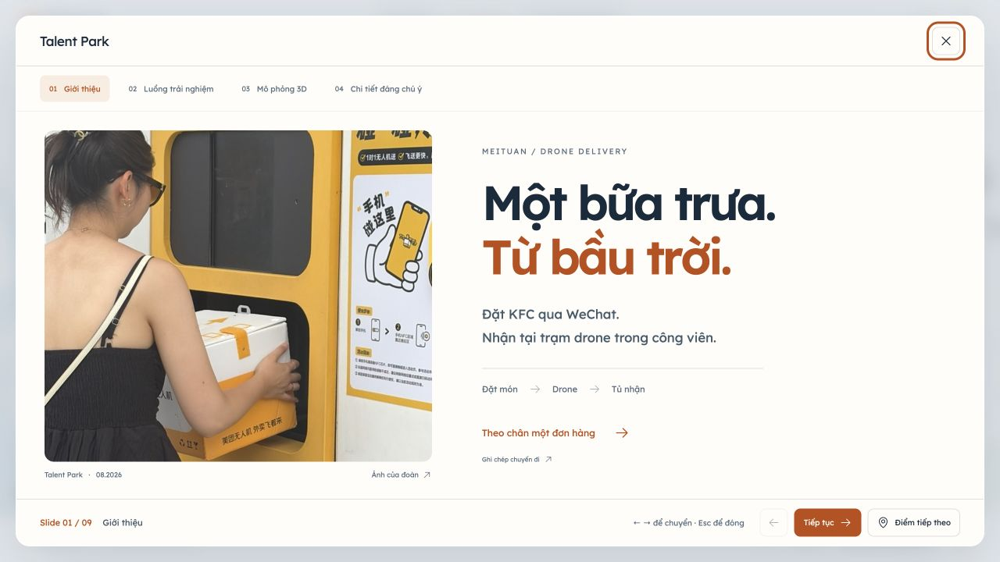
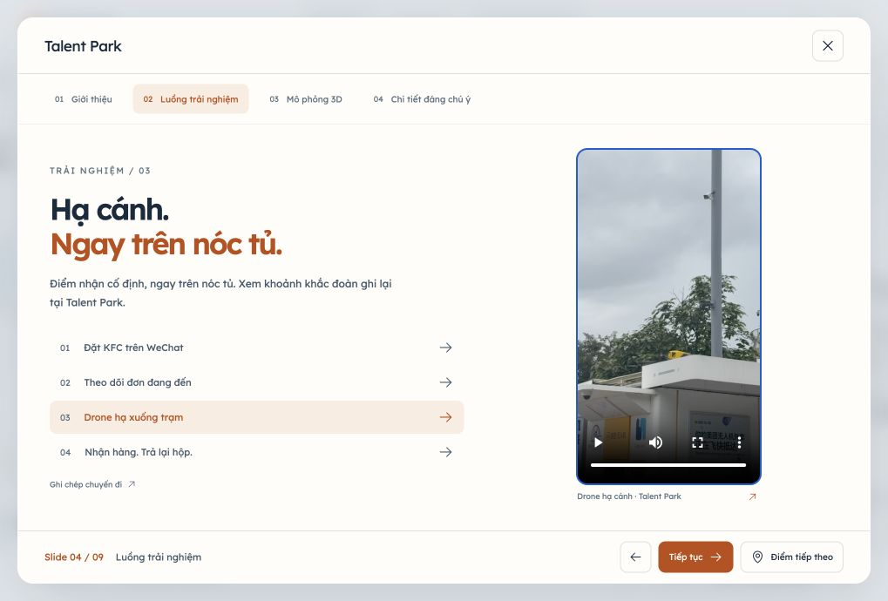
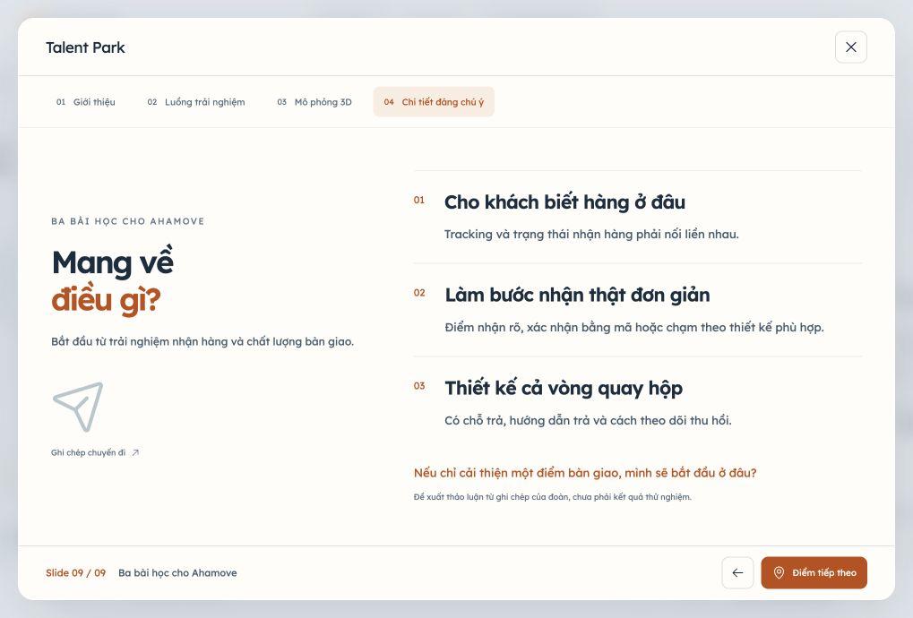
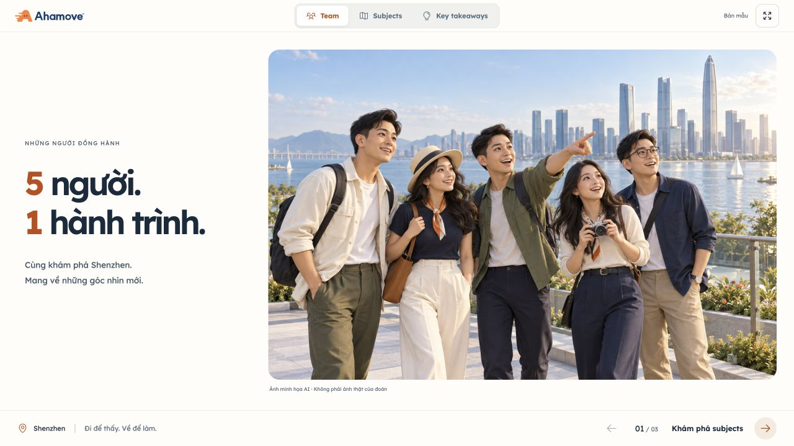
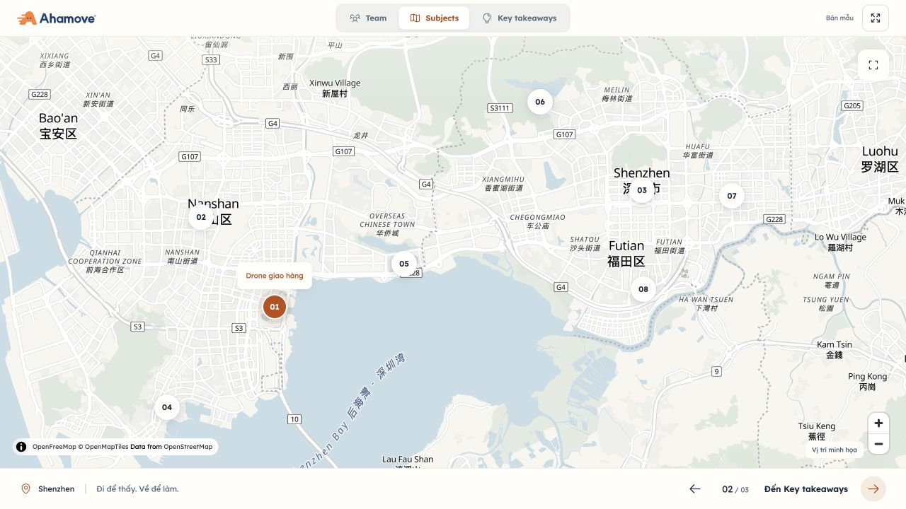
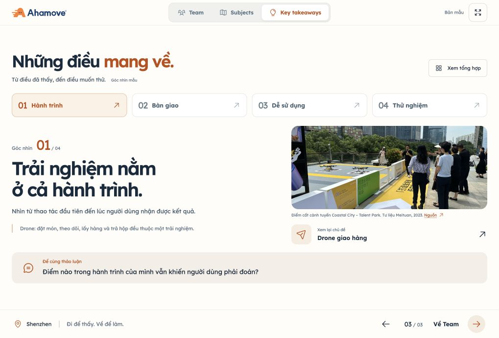

# Shenzhen Live — bản mẫu đã triển khai

Cấu trúc hiện tại: **Team → Subjects trên live map → Key takeaways**, light mode. Người dùng cho phép mock data; tên thành viên, vai trò, nội dung chia sẻ, takeaways và vị trí ghim minh họa đều có nhãn mẫu.

- Team: giới thiệu ngắn và ảnh nhóm lớn chiếm khoảng 70% chiều ngang nội dung trên desktop. Đã bỏ khối góc nhìn, nút chuyến bay và dãy chọn thành viên theo phản hồi.
- Subjects: live map OpenFreeMap/MapLibre làm giao diện chính, tám ghim subject mở trực tiếp bài trình chiếu và nút Toàn cảnh. Bản đồ có kéo, zoom và điều hướng bàn phím. Đóng bài trình chiếu trở về map.
- Tám subjects có giới thiệu, luồng trải nghiệm theo bước và ba chi tiết để thảo luận. Drone có mô phỏng 3D gồm 13 bước và nút bỏ qua.
- Key takeaways: bốn góc nhìn mẫu, liên kết trở lại subject, câu hỏi thảo luận và chế độ tổng hợp.
- Hỗ trợ URL tới cảnh, tải lại giữ cảnh, nút trình chiếu toàn màn hình và responsive.

Nội dung thay tại `src/data/presentation.ts`. Vị trí ghim thay tại `src/data/subjectLocations.ts`; đây chưa phải danh sách điểm đoàn đã trải nghiệm. Các tư liệu kỹ thuật cũ được giữ trong source nhưng không còn nút mở thư viện trên map.

Map đã bỏ thẻ preview; bấm ghim mở trực tiếp nội dung. Header cao 52px với cụm tab có icon, mục đang chọn màu cam và nút toàn màn hình gọn. Đã bỏ nhãn Shenzhen góc trái, nút thư viện tư liệu và menu “8 subjects”. Map giữ nút Toàn cảnh, zoom, nhãn ghim khi hover/focus/được chọn, attribution và chú thích vị trí minh họa.

## Nâng cấp hình ảnh

Hướng thiết kế: tạp chí hành trình dành cho buổi chia sẻ nội bộ, nền sáng và cam Ahamove. Design variance 7, motion intensity 5, visual density 3. Dùng React, CSS và bộ icon Phosphor hiện có.

- Team: ảnh nhóm minh họa mới, typography lớn và hiệu ứng xuất hiện một lần. Ảnh mobile giữ đủ năm gương mặt; không khôi phục các khối đã yêu cầu xóa.
- Subjects: nền [OpenFreeMap Positron](https://github.com/hyperknot/openfreemap-styles) với nước xanh nhạt và cây xanh dịu; các ghim nổi trên nền map. Giữ attribution, tọa độ minh họa và tương tác trực tiếp.
- Takeaways: bốn lựa chọn ngang trên desktop, nội dung dạng trang tạp chí cùng ảnh subject, liên kết xem lại và câu hỏi thảo luận. Chế độ tổng hợp hiển thị bốn góc nhìn.
- Cửa sổ subject: tab chọn cảnh rõ hơn, ảnh bo góc, typography và các bước trải nghiệm thống nhất. Nút điều hướng vẫn 36px.
- Chuyển động có `prefers-reduced-motion`; không thêm thư viện.

Ảnh mới dùng built-in Imagegen: [asset](../../assets/generated/shenzhen-team-editorial-v2.png), [prompt đầy đủ và ghi chú nguồn](../../assets/generated/shenzhen-team-editorial-v2.md). Đây là nhân vật minh họa, không phải ảnh thật của đoàn.

Nút điều hướng trong subject cao 36px. “Tiếp tục” chuyển bước, “Điểm tiếp theo” mở chủ đề kế tiếp ngay từ bất kỳ cảnh nào; chủ đề cuối dẫn tới Key takeaways ở cảnh cuối.

Header của subject chỉ hiện tên địa điểm từ dữ liệu ghim, không còn icon, tên thành viên hay dòng nội dung mẫu. Nút đóng chỉ hiện X, có nhãn truy cập “Đóng, về live map”. Header cao 64px trên desktop và 60px trên mobile.

Đã hoàn tác thử nghiệm trình chiếu ưu tiên ảnh/video theo phản hồi: khôi phục modal hai cột, danh sách bước, mô tả và ba chi tiết; giữ tên địa điểm, nút X và nút Điểm tiếp theo.

## Kiểm tra

- `npm run build`: TypeScript và Vite build thành công. Còn cảnh báo kích thước chunk của thư viện map/3D; chúng được tải khi cần.
- `node --test tests/*.test.mjs`: 15/15 qua, gồm điều hướng URL và các kiểm thử mô hình/chuyển động hiện có.
- Trình duyệt 1280×720: các cảnh của cả tám subjects; phím mũi tên/Esc; chuyển subject; focus khi đóng; chọn takeaway và mở tổng hợp.
- Live map: nền bản đồ tải thực; tám ghim; bấm ghim mở thẳng chương; đóng chương trở về map; đưa về toàn cảnh. Menu subjects đã được bỏ theo phản hồi tiếp theo.
- Mobile 390×844: Team/Subjects/Takeaways không tràn ngang; chọn ghim trên map, mở subject, đóng bằng nút có nhãn; tải lại giữ đúng subject/cảnh.
- Mô phỏng drone 3D được tải trong trình duyệt. Bộ tư liệu Bay Park cũ đã được kiểm tra trước khi bỏ nút thư viện.
- Kiểm tra sau chỉnh sửa ở 1019×690 và 320×740: header 52px, nút subject 36px; “Tiếp tục” chuyển tới bước 2, “Điểm tiếp theo” chuyển từ Delivery sang Mobility rồi Payment. Team không còn ba khối đã bỏ.
- Sau nâng cấp hình ảnh: build và 15/15 tests qua. Kiểm tra trực tiếp ở 1280×720, 1019×690, 390×844 và 320×740; không tràn ngang ở các trang đã kiểm tra. Desktop Takeaways vừa khung. Đã chọn bốn góc nhìn, mở tổng hợp, mở subject từ Takeaways, chọn ghim, chuyển bước/điểm và đóng bằng Esc. Không ghi nhận lỗi console trong lượt kiểm tra.
- Sau thu gọn header subject: build qua; kiểm tra Expo trên desktop và Sea World · Shekou ở 390×844. Nút X hiển thị trên cả hai kích thước; bấm X trở về map và focus lại ghim.
- Sau chuyển sang trình chiếu tư liệu: build và 15/15 tests hiện có qua. Kiểm tra 1019×690, 390×844, 320×740; không tràn ngang ở các cảnh được kiểm tra. Video publisher tải thực, `readyState=4`, chạy hết 13.1 giây. Đã kiểm tra đổi ảnh, xem trọn ảnh, ghi chú/Esc/focus, 3D/chuyển bước, ba chi tiết, điểm tiếp theo, đóng về ghim và chủ đề cuối tới Takeaways. Không ghi nhận lỗi console trong lượt kiểm tra.

Giới hạn: chưa trình chiếu trên máy chiếu thực hoặc kiểm tra screen reader chuyên dụng. Bản đồ cần mạng. Ảnh minh họa không thay thế bộ ảnh/video chuyến đi thật của đoàn.

## Cập nhật bài drone từ sheet — 21/09/2026

- Dùng **Outline_Sharing_Shenzhen_Trip**, Outline Sharing B9/E9/F9, F23 và F30 làm nguồn cho 9 slide trong modal drone. Không thay giao diện chung của bảy subject khác.
- Ba ảnh và hai video được gắn từ các link trực tiếp ở F9/F23. [Nguồn, file gốc và giới hạn bằng chứng](../../public/media/trip/drone/SOURCES.md); [bố cục và lời dẫn từng slide](../drone-talent-park-slides.md).
- Sau phản hồi bố cục: trang mở đầu chỉ có một ảnh nhận hàng lớn, tiêu đề lớn và một đường dẫn vào hành trình. Bỏ hai cột ảnh nhỏ và danh sách bước lặp ở mở đầu. Các bước đặt tiêu đề/mô tả và điều hướng bên trái, tư liệu lớn bên phải. Ảnh căn khung vào chủ thể, video dọc không bị cắt. Mobile đưa tư liệu lên trước.
- Giữ header tên địa điểm, nút X, bốn tab, footer với nút 36px và Điểm tiếp theo. Bốn bước trải nghiệm và ba slide kết luận được chuyển bằng Tiếp tục; 3D vẫn là phần minh họa tùy chọn 13 bước, tách khỏi tư liệu Talent Park.
- Giữ focus trong dialog khi nút Tiếp tục biến mất ở slide cuối, để phím mũi tên/Home/End/Esc tiếp tục hoạt động.
- Build TypeScript/Vite và 15 kiểm thử sẵn có qua. Cảnh báo chunk map/3D lớn vẫn còn.
- Kiểm tra trình duyệt: 1019×690 và 1280×720; responsive 390×844 và 320×740. Đã xem các slide 1–9, phát hết video landing 4.333333 giây và rider 7.933333 giây (`readyState=4`, `ended=true`), chọn bước, chuyển/lùi qua ranh giới 3D, bỏ qua 3D, Home/End, sang Delivery rồi đóng về map đúng ghim. Không thấy lỗi console trong lượt kiểm tra.
- Nguồn thời gian B9 ~4 phút/B23 ~60 phút chưa rõ phạm vi; không trình bày thành KPI. Chưa có ảnh tracking app trong ba file drone đính kèm; các slide đặt món/tracking ghi rõ dùng ảnh điểm nhận. Tư liệu rider là quan sát riêng. Chưa kiểm tra máy chiếu thực.

## Các phần còn lại

