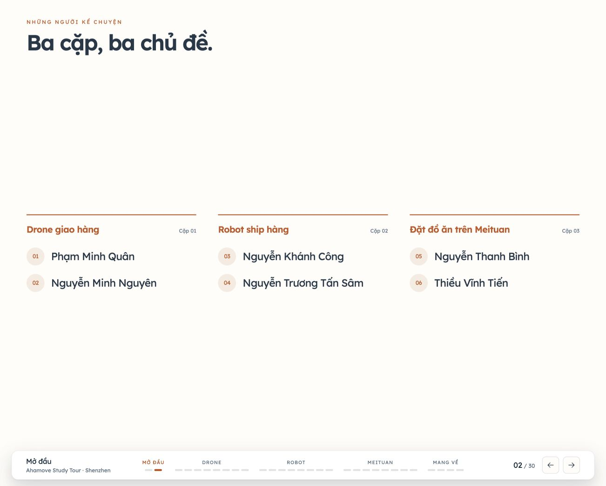
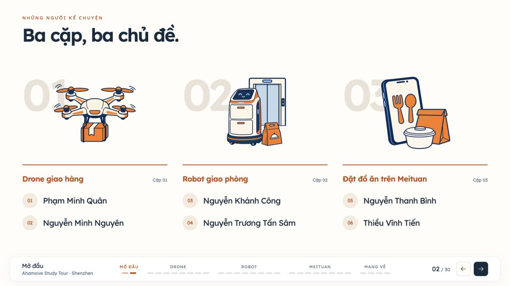
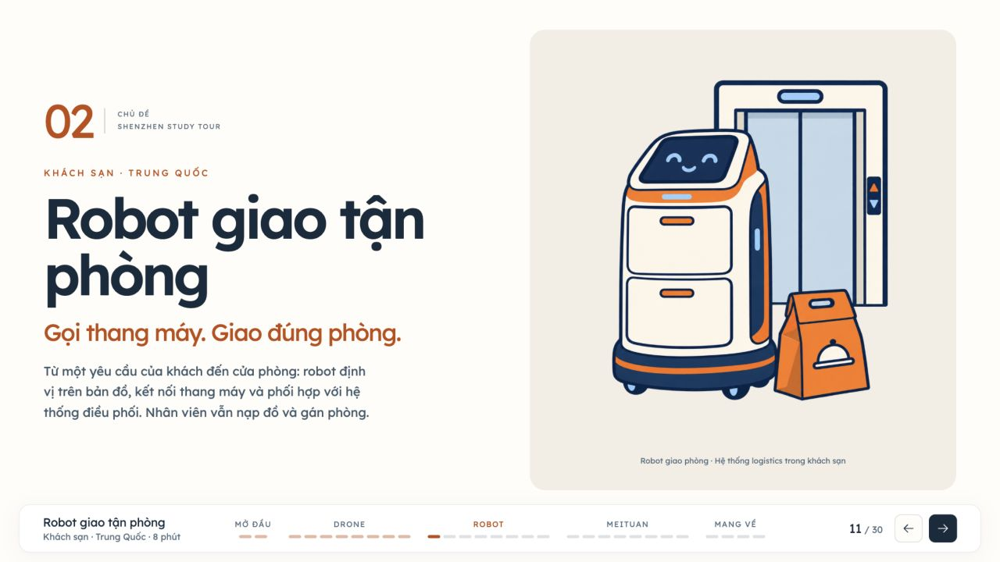
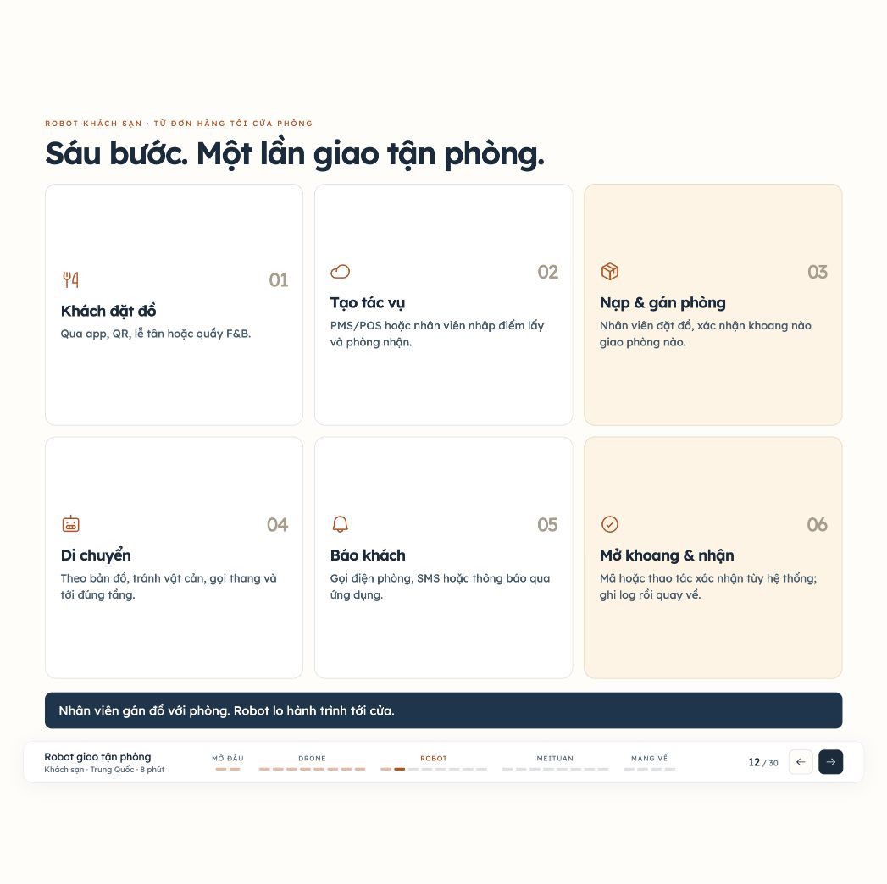
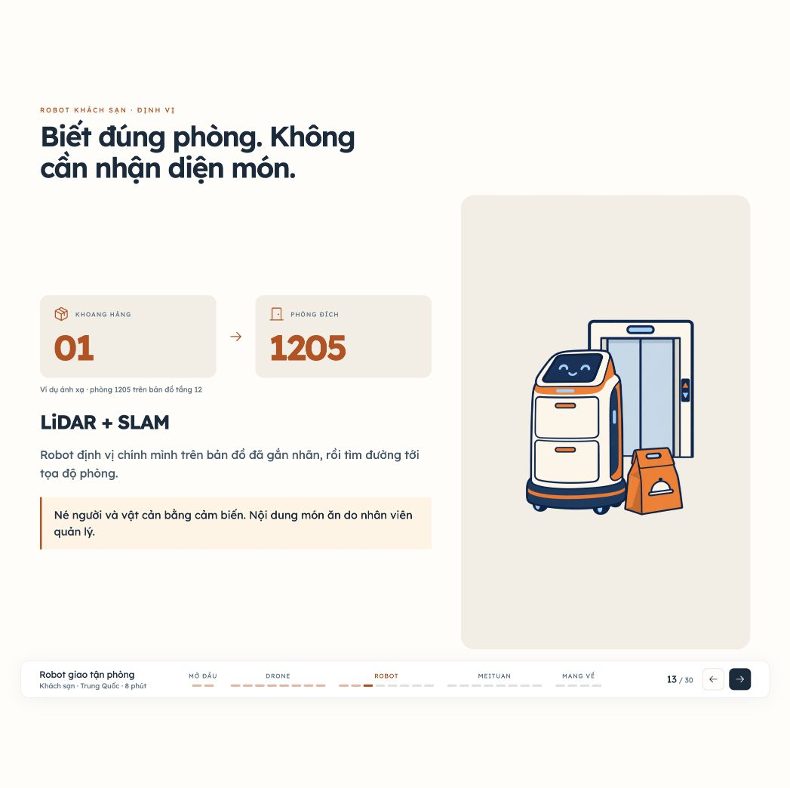
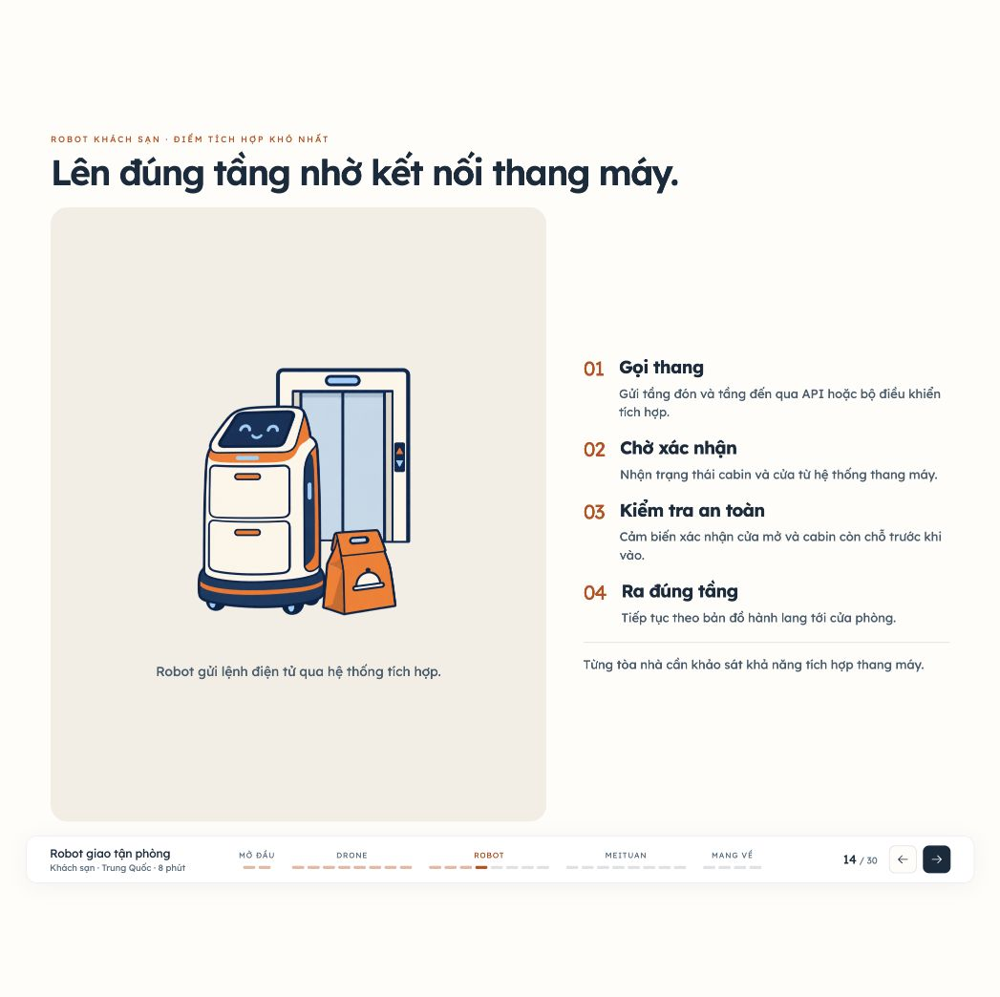
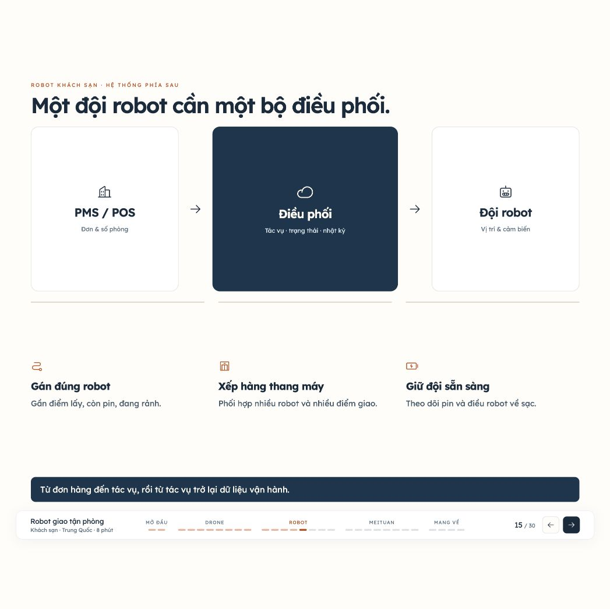
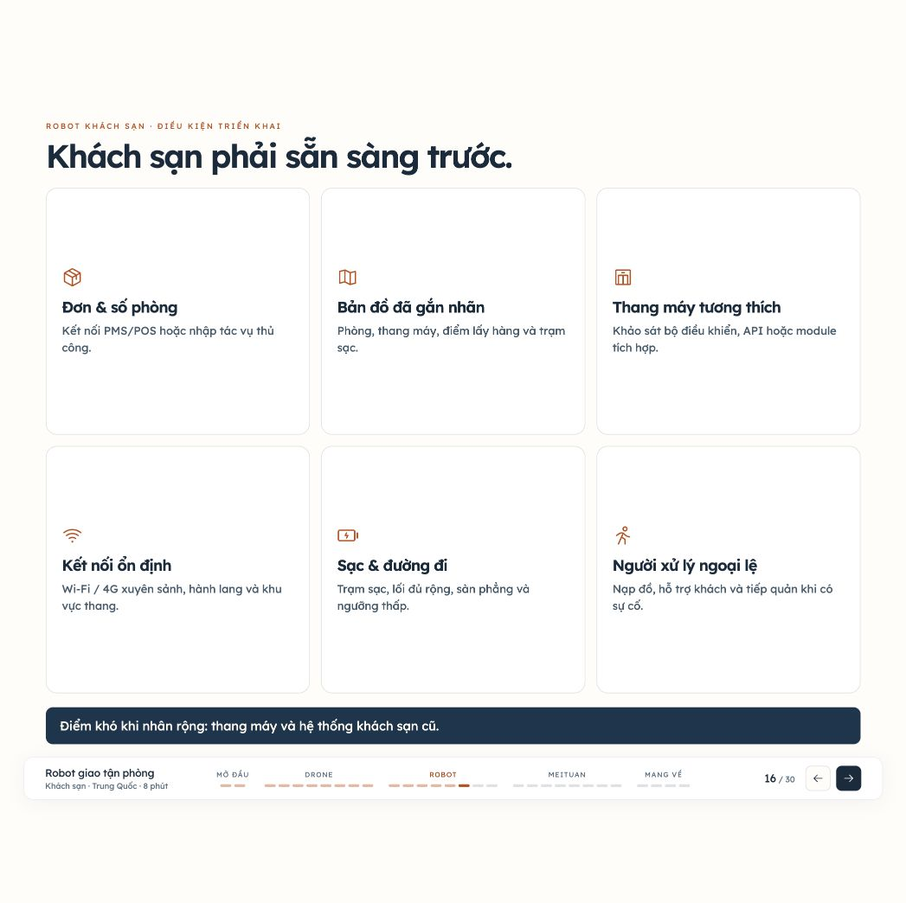
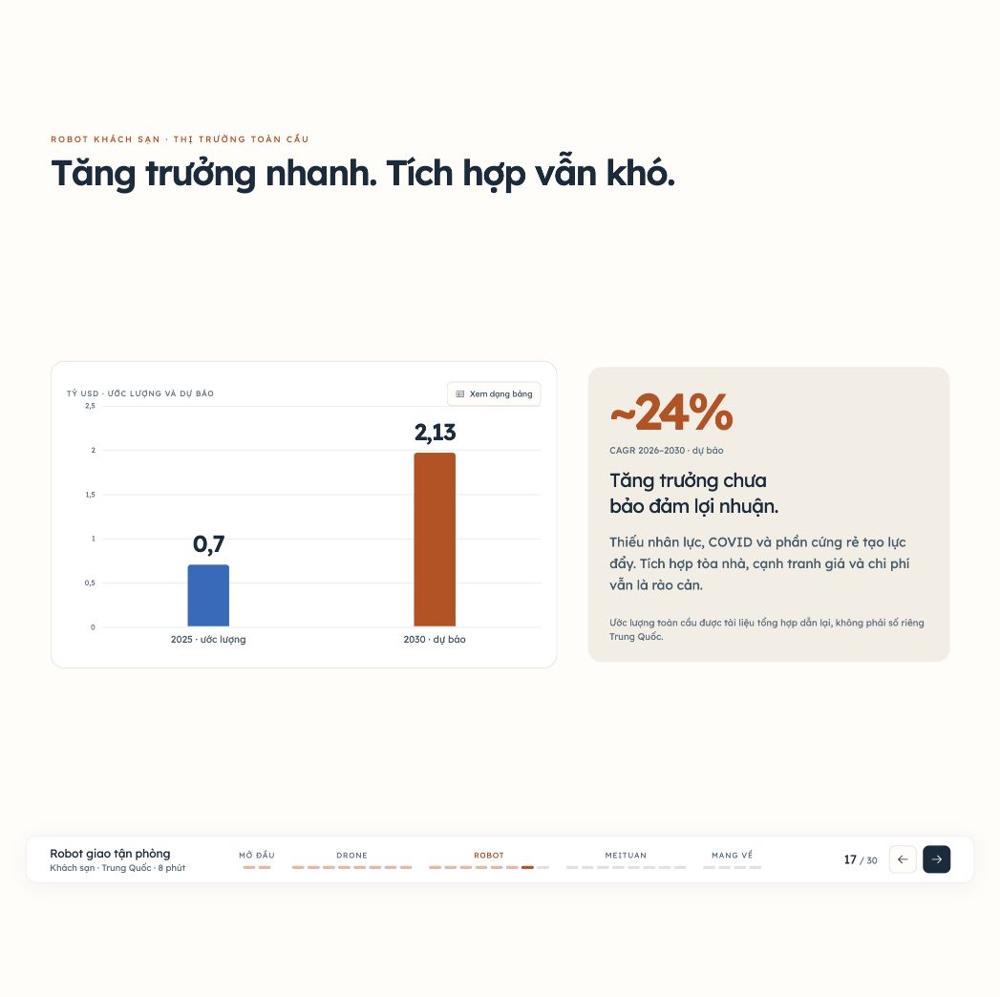
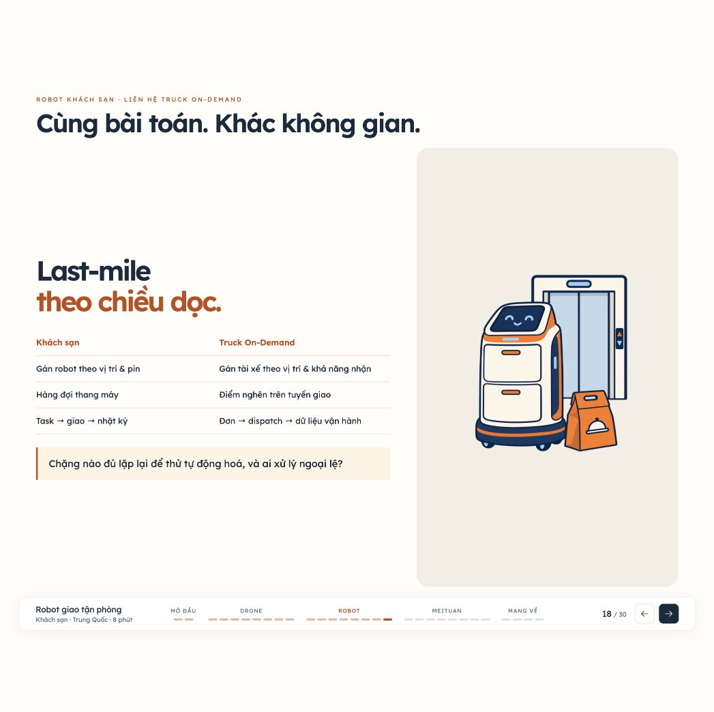

# Review và cập nhật deck — 22/09/2026

Giữ cấu trúc 30 slide tuyến tính, sáu thành viên, điều hướng số slide và nội dung tài liệu của người dùng. Review từ giao diện đang chạy trong lượt này; không dùng ảnh cũ làm bằng chứng.

## Những điểm đã chỉnh

| Bước | Màn hình | Nhận xét trước sửa | Trạng thái sau sửa |
| --- | --- | --- | --- |
| 1 | Poster mở đầu, slide 1 | Hình đã đủ nổi bật; không cần thêm trang hoặc hiệu ứng | Giữ poster và bố cục tràn mặt slide |
| 2 | Nhóm, slide 2 | Chỉ có tên và đường kẻ; khoảng trống lớn, thiếu hình nhớ chủ đề | Thêm ba hình 2D, số chương và giữ đủ sáu tên thật |
| 3 | Mở chương, slide 3/11/19 | Tiêu đề rõ nhưng ba chương chưa có dấu mở đầu dễ nhận ra | Thêm số chương; hình và nội dung robot đổi đúng sang khách sạn |
| 4 | Số liệu và biểu đồ | Thẻ số kéo cao, cấp độ nhấn còn phẳng | Con số chính trên nền navy, cột số phụ gọn, hình 2D và khối đọc biểu đồ |
| 5 | Trải nghiệm và cơ chế | Cần giữ video, bảng dữ liệu và thao tác trình chiếu | Video phát được; Space kích hoạt nút đang focus; chương robot có quy trình riêng |
| 6 | Mang về, slide 27–30 | Ảnh lặp lại; câu kết thiếu từ khóa dễ nhớ | Từ khóa lớn và hình 2D; sửa hai kết luận liên quan robot/hạ tầng |

### Nhóm — trước và sau

### Robot — phạm vi đã sửa

Nguồn do người dùng cung cấp: [Robot giao hàng tận phòng tại khách sạn Trung Quốc](https://docs.google.com/document/d/17bI67RGsjEB8GECcz_JJnRICAKicv2CofpdORjiz77Y/edit?tab=t.0). Đã đọc toàn văn qua Google Drive; bản chụp ở [sources](../sources/hotel-room-delivery-2026-09-20.md).

Chương cũ trộn xe tự hành ngoài đường với robot giao phòng và dùng ảnh rider. Chương mới gồm:

| Slide | Nội dung | Tình trạng review |
| --- | --- | --- |
| 11 | Robot giao tận phòng | Đúng phạm vi khách sạn; hình 2D mới |
| 12 | Sáu bước giao hàng | Đủ đặt đơn → tác vụ → nạp/gán → di chuyển → báo khách → nhận |
| 13 | Ánh xạ phòng, LiDAR + SLAM | Phòng 1205 ghi rõ là ví dụ |
| 14 | Tích hợp thang máy | Có phản hồi trạng thái và bước kiểm tra an toàn |
| 15 | Điều phối đội robot | Gán đơn, phối hợp thang máy, quản lý pin |
| 16 | Điều kiện khách sạn | PMS/POS hoặc task thủ công; bản đồ, thang, kết nối, sạc, con người |
| 17 | Thị trường | Phân biệt toàn cầu, ước lượng 2025 và dự báo 2030 |
| 18 | Truck On-Demand | Đối chiếu bài toán điều phối, điểm nghẽn và nhật ký |

## Kiểm tra và giới hạn

- Build TypeScript/Vite đạt. 18 kiểm tra dữ liệu, phạm vi robot, thứ tự 30 slide và hash navigation đạt.
- 30 slide × 2 khung (1280×720, 1280×600): không phát hiện nội dung đè xuống thanh điều hướng, vượt cạnh slide hoặc ảnh lỗi. Mỗi bước đợi đúng heading mới trước khi đo. Kết quả: [final-layout-checks.json](final-layout-checks.json).
- Nhãn “Minh hoạ” không còn trong phần text hiển thị ở cả 60 trạng thái. Thông tin hình AI còn trong alt, nguồn và [prompt của bộ hình](../../public/media/illustrations/subjects-2d/generation.json), theo yêu cầu người dùng.
- Video drone: `paused: false`, `readyState: 4`. Nút xem bảng kích hoạt bằng Space giữ nguyên slide 6 và hiển thị đủ ba mốc số liệu.
- Chuyển động vào trang và biểu đồ tôn trọng `prefers-reduced-motion` qua CSS. Chưa thực hiện một audit accessibility toàn diện hoặc thử máy chiếu thật; khung cố định của deck ưu tiên màn trình chiếu, không phải chế độ đọc điện thoại.
- Toàn bộ suite được chạy trong lượt này: một test mô hình Worker 3D hiện lỗi `loading foot jumps 0.042 world units between frames` ở `tests/shenzhen-city.test.mjs:69`. Các file mô hình/animation không được chỉnh trong công việc này. Không tuyên bố toàn bộ suite xanh.
- Số thị trường robot được biên tập theo tài liệu nội bộ người dùng gửi; chưa đối chiếu độc lập các báo cáo gốc mà tài liệu dẫn tên. Không coi đây là xác nhận thiết bị hoặc khách sạn đoàn đã trải nghiệm.

Không commit hoặc deploy trong lượt này. Preview local: http://127.0.0.1:4173/#11.
